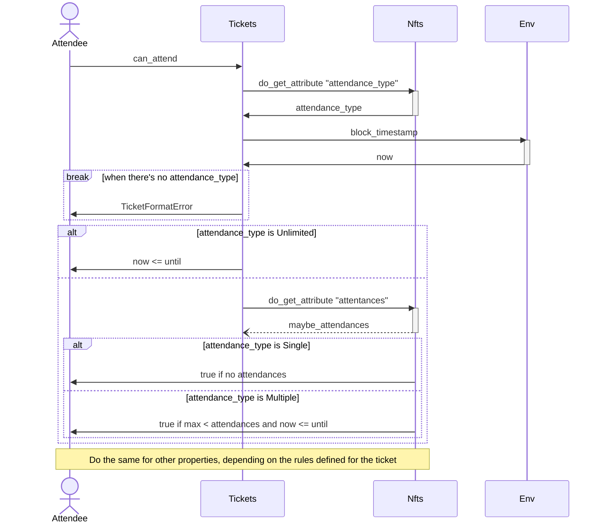
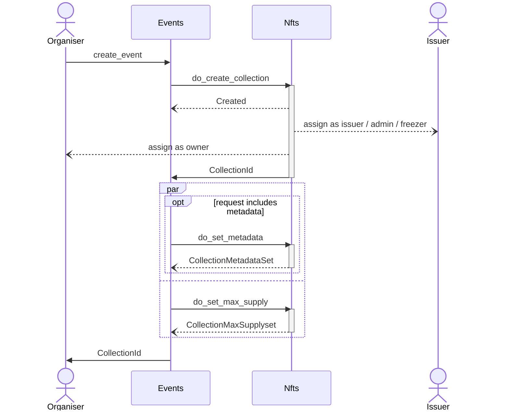
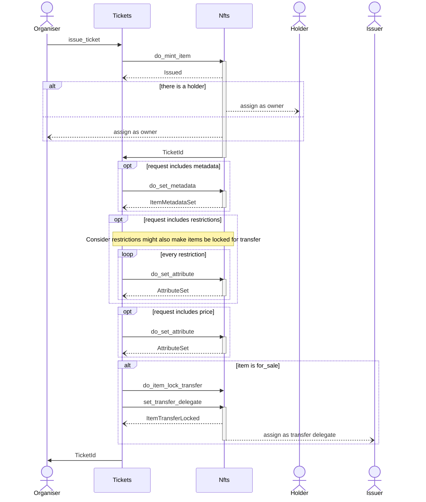
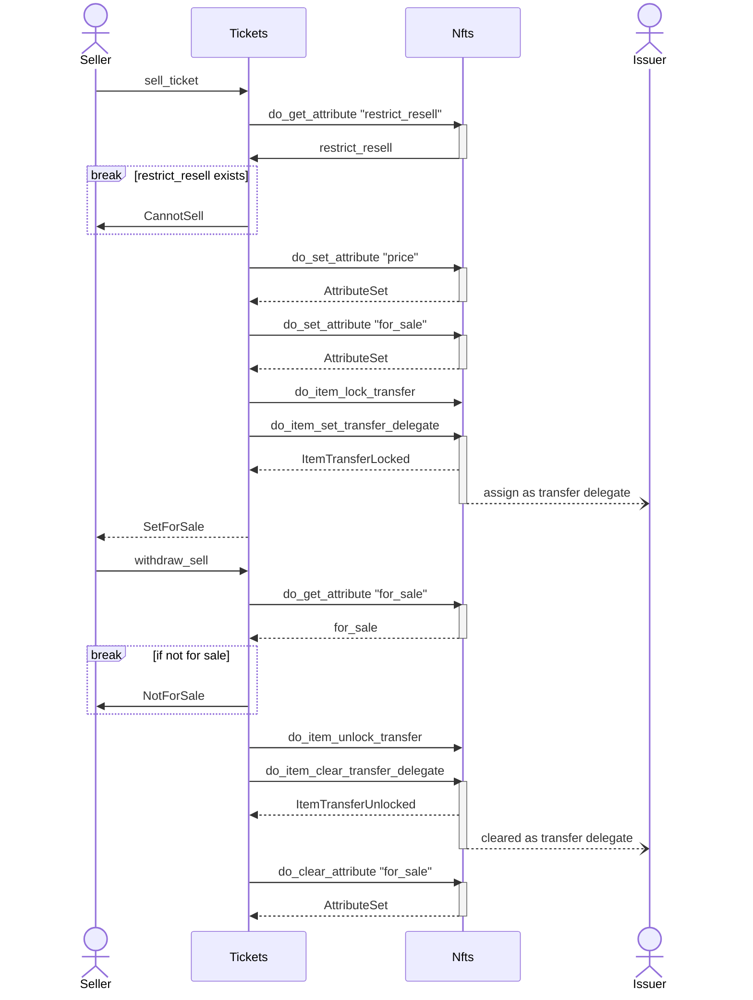
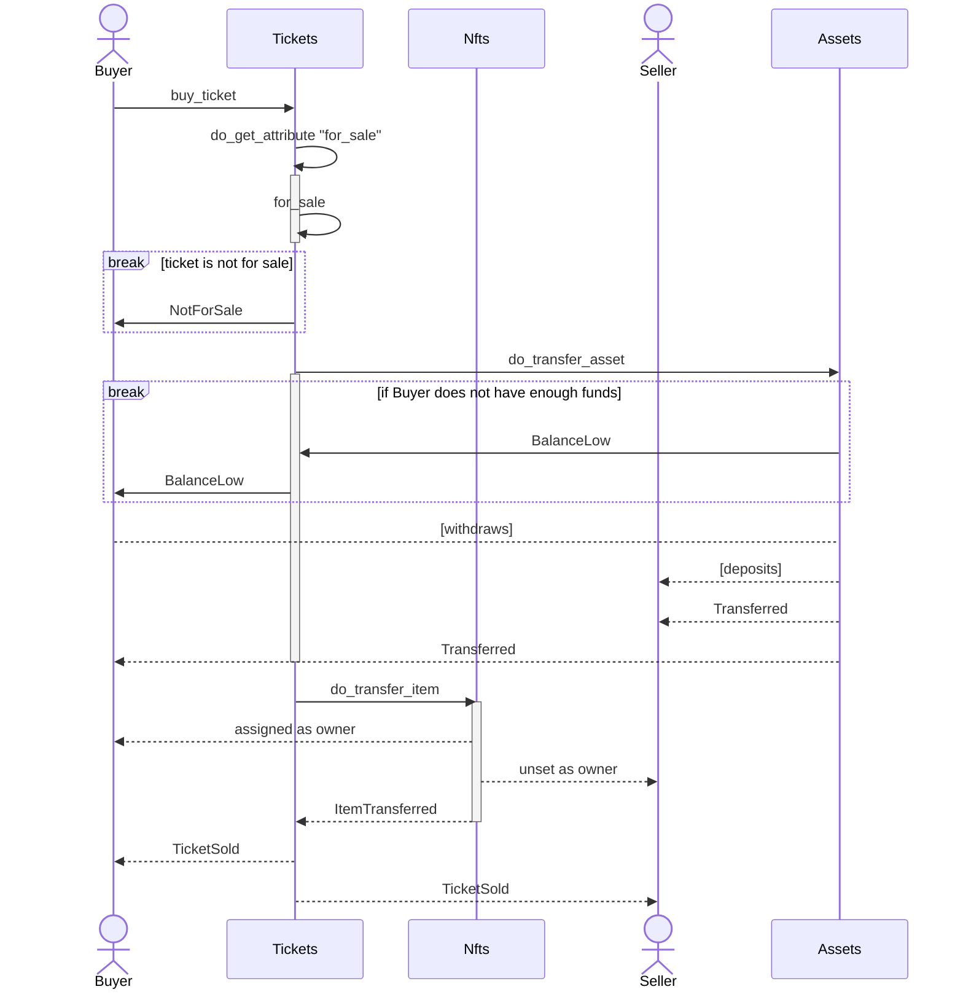
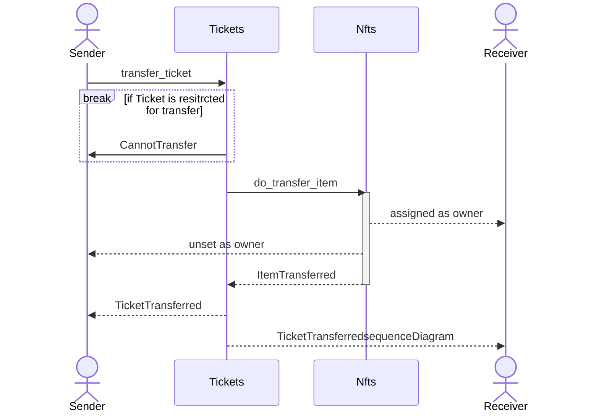
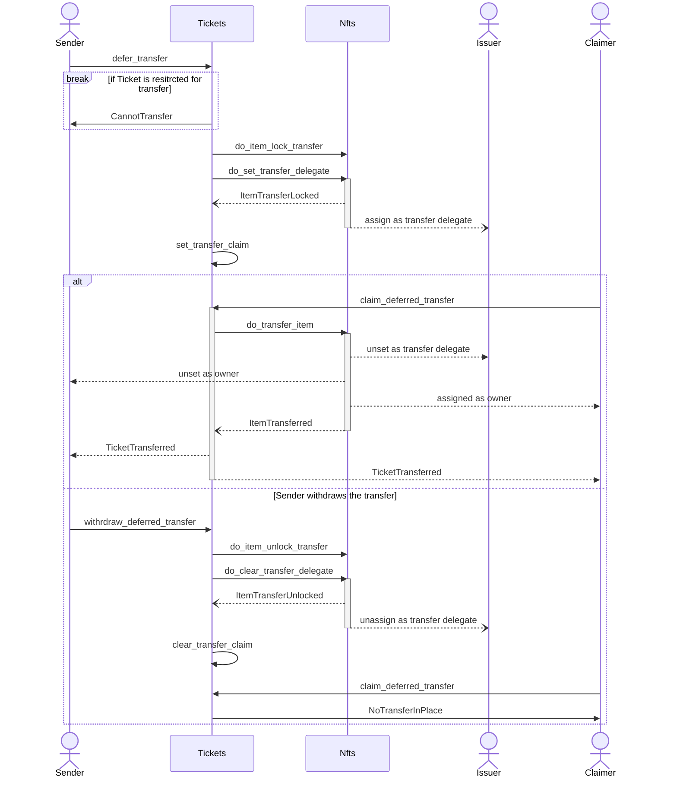
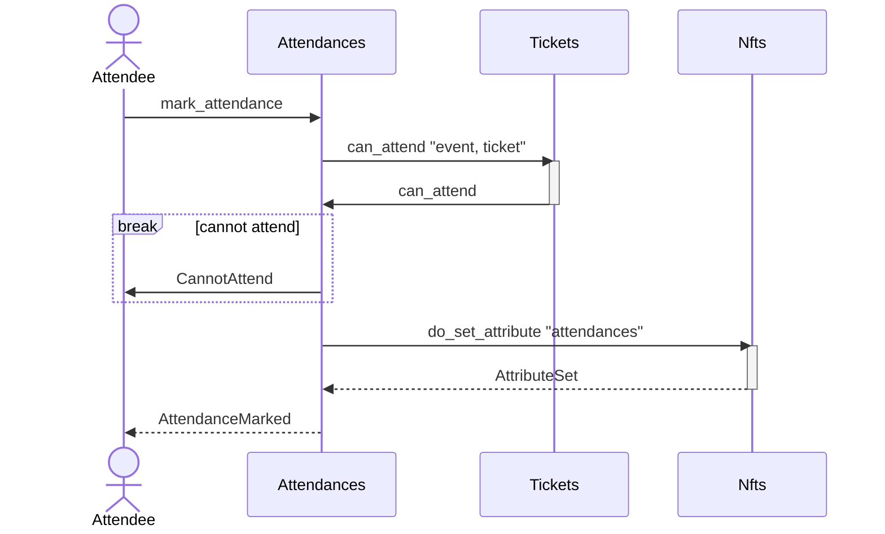

# The Ticketto Protocol

**Version**: 1.0.0-draft.0 (2024/01/14)

**Authors**:

- [P. Dorado](https://github.com/pandres95)

## Table of Contents

1. [Summary](#summary)
2. [Motivation](#motivation)
3. [Proposed Implementation](#proposed-implementation)
    1. [Definitions](#definitions)
    2. [Participants](#participants)
    3. [Modules](#modules)
    4. [Queries](#queries)
    5. [Commands](#commands)
4. [Conclusion](#conclusion)

## Summary

The Ticketto Protocol is a decentralised protocol to easily and securely issue, hold, and transfer tokens to grant access to events.

## Motivation

When organising an event, one of the crucial steps (aside from picking a venue and deciding the content that will be shown) is determining which people will attend to it, and how to verify people are granted to do so. This is an already solved problem: you either decide a closed list of attendees, or issue tickets and distribute among attendees through various means (like selling, giving away, or a combination of both).

Centralised ticketing systems overall tend to lack have of some (if not all) issues related to credibility, protection against fraud, falsification, and control over secondary markets (when intended).

NFTs provide the necessary tools to circumvent those issues. Also, providing a publicly auditable solution that helps other stakeholders (like venue owners and event promotors) gain credibility by giving information of the status of an event success in terms of ticket issuance/selling.

Finally, some tickets might grant multiple instances of acccess to an event, such a club membership or a ticket for an online conference.

This protocol aims to define a ticketing system based on NFTs, helping to solve the aforementioned issues.

## Proposed Implementation

### Definitions

- **Event**: A gathering, both physical and virtual. On-chain, events are usually defined as nonfungible collections.
- **Ticket**: A token used to get access to the event.  On-chain, tickets are usually defined as nonfungible items (a.k.a. NFTs).
- **Attendance**: The act of marking a timestamp on a ticket, indicating it has been used for having gotten access to an event. Tickets might support single or multiple attendances, depending on the rules applied to it.
- **Deferred transfer**: The act of transferring a ticket to an unknown account, via a commit-reveal scheme.

### Participants

- **Event organisers**: An account that creates an handles the state of an _event_.  
- **Event promoters**: An entity (person, company, etc.) enabled to sell _event tickets_ and receive a referral fee in exchange.
- **Ticket holders**: An account that owns a _ticket_.
- **Event attendee**: A **ticket holder**, that intend to get access to an _event_.
- **Entrance operators**: An entity (application, person) in charge of granting or denying access to an _event_.
<!-- - **Ticket issuer**: An account that can intermediate in the process of issuing the tickets and covering deposit costs to accounts, usually charging amounts via stablecoin assets. -->
- **Ticket claimer**: An account that owns a commit message enabling them to receive a _ticket_ that is pending to be transfered via _deferred transfer_.
- **Ticket resellers**: A **ticket holder** that is interested in reselling their own ticket on a secondary market.
- **Venue owners**: An entity that owns the venue where an _event_ will be held.

### Modules

- **Events Module**: Allows handling operations of an _event_.
- **Tickets Module**: Allows handling actions related to owning a _ticket_, such as _registering an attendance_, _deferred transfering_ and safely _selling a ticket_ using a fungible asset.
- **Attendances Module**: Allows handling actions related to attending an _event_ with a _ticket_, such as _registering an attendance_.

### Types

#### Ticket Restrictions (part of _Tickets Module_)

Enables some restrictions for the ticket at issuance time

```rs
#[derive(Default)]
struct TicketRestrictions {
    cannot_resale: bool;
    cannot_transfer: bool;
}
```

#### Attendance Type (part of _Tickets Module_)

Sets the behaviour for attending with a ticket. May be `Single` (i.e. entering a concert), `Multiple` (i.e. a fast pass with a limit of `n` usages), or `Unlimited` (a membership on a night club, or a day pass at a hotel) with an optional expiration date.

```rs
enum AttendancePolicy {
    Single,
    Multiple { max: u32, maybe_until: Option<Timestamp> },
    Unlimited { maybe_until: Option<Timestamp> },
}
```

### Queries

#### Attendance Validation (part of _Tickets Module_)

Returns whether an **event attendee** is able to get access to an _event_, depending on the attributes (_attendance_type_, _attendances_, _expiration_date_, etc.) marked on their _ticket_.

```rs
fn can_attend(
    event: EventId,
    ticket: TicketId
) -> bool
```



### Commands

#### Creating an event (part of _Events Module_)

An **organiser** calls up a method called `create_event`, passing a definition of the event (`max_capacity` and (optional) `metadata`).

Then, an account on behalf of the protocol (a.k.a. the **issuer**) is assigned as admin, and the **organiser** is assigned as owner. This is done, so it's easier to the protocol can execute permissioned actions over collections and items.

```rs
fn create_event(
    origin: AccountId,
    capacity: MaxCapacity,
    maybe_metadata: Option<Vec<u8>>,
) -> Result<EventId>;
```



#### Issuing a ticket (part of _Tickets Module_)

An **organiser** issues a _ticket_, including the `attendance_type`, and optionally stating some `attributes` to it and/or `metadata`.

If desired by the **event organiser**, a _ticket_ can be immediately minted on behalf of a **holder**.

It's possible for a _ticket_ to be restricted (for _selling_, such as always free tickets, or _transferring_, like scolarship-class tickets).

Finally, **organiser** can also set a `price`, and mark it as `for_sale` (if this option is true, and the price is set as `None`, a default price ).

```rs
fn issue_ticket(
    origin: AccountId,
    event: EventId,
    attendance_type: AttendancePolicy,
    maybe_holder: Option<AccountId>,
    maybe_attributes: Option<Vec<ItemAttribute>>,
    maybe_metadata: Option<Vec<u8>>,
    maybe_restrictions: Option<TicketRestrictions>,
    maybe_price: Option<{ asset: AssetId, amount: Balance }>,
    for_sale: bool,
) -> Result<TicketId>;
```



#### Selling a ticket (part of _Tickets Module_)

A **ticket holder** can mark a ticket as `for_sale` and set a `price` at any moment, unless the ticket is marked as `cannot_resale`.

```rs
fn sell_ticket(
    origin: AccountId,
    event: EventId,
    ticket: TicketId,
    price: { asset: AssetId, amount: Balance }
) -> Result<()>;
```

At any point, the **holder** may choose to stop selling the _ticket_.

```rs
fn withdraw_sell(
    origin: AccountId,
    event: EventId,
    ticket: TicketId,
) -> Result<()>;
```



#### Buying a ticket (part of _Tickets Module_)

When a ticket is marked as `for_sale`, an account holding the amount requested in the price would be able to execute this call and get the _ticket_ transferrd in exchange to the specified funds. Once sold, the protocol will modify the _ticket_ to remove the `price` and the `for_sale` flag.

```rs
fn buy_ticket(
    origin: AccountId,
    event: EventId,
    ticket: TicketId,
) -> Result<()>;
```



#### Transferring a ticket (part of _Tickets Module_)

When a _ticket_ is not marked as `restrict_transfer`, its **ticket holder** may transfer it to another account, without the receiver needing to accept the transfer.

```rs
fn transfer_ticket(
    origin: AccountId,
    event: EventId,
    ticket: TicketId,
    receiver: AccountId,
) -> Result<()>;
```



#### Deferred transferring a ticket (part of _Tickets Module_)

When a _ticket_ is not marked as `restrict_transfer`, its **ticket holder** may commit for transfer using a [commit-reveal scheme](https://en.wikipedia.org/wiki/Commitment_scheme). This is so a receiver that initially doesn't own an account is able to claim it later.

The scheme starts by calling `defer_transfer`, with the `commit` message, and an optional `expiration` date.

```rs
fn defer_transfer(
    origin: AccountId,
    event: EventId,
    ticket: TicketId,
    commit_message: Vec<u8>,
    maybe_expiration: Optional<Timestamp>,
) -> Result<()>;
```

Once the receiver has created an account, they can call `claim_deferred_transfer` to reveal the commitment, using a `claim` message, receiving the transfered _ticket_ as a result.

```rs
fn claim_deferred_transfer(
    origin: AccountId,
    event: EventId,
    ticket: TicketId,
    claim_message: Vec<u8>,
) -> Result<()>;
```

It's possible, at any moment, that the **ticket holder** cancels the deferred transferring, thus unlocking the item for transfer to another party (or even, [selling](#selling-a-ticket-part-of-tickets-module) it).

```rs
fn cancel_deferred_transfer(
    origin: AccountId,
    event: EventId,
    ticket: TicketId,
) -> Result<()>;
```



<!-- #### Future outcomes

It is possible that part of this module (the selling use cases) can be moved towards a new system pallet (a.k.a. `nfts-marketplace`, where also NFTs auctions can be included).  -->

#### Registering an attendance (part of _Attendances_ Module)

The main use case on this protocol. grants **ticket holder** to get access to an _event_ using a _ticket_.

```rs
fn mark_attendance(
    origin: AccountId,
    event: EventId,
    ticket: TicketId,
) -> Result<()>;
```



## FAQ

<details>
    <strong><summary>On the commit-reveal scheme that's involved in the <code>deferred_transfer</code> flow, how can we solve up for frontrunning on the <i>reveal</i> phase?</strong></summary>
    <p></p>
</details>
